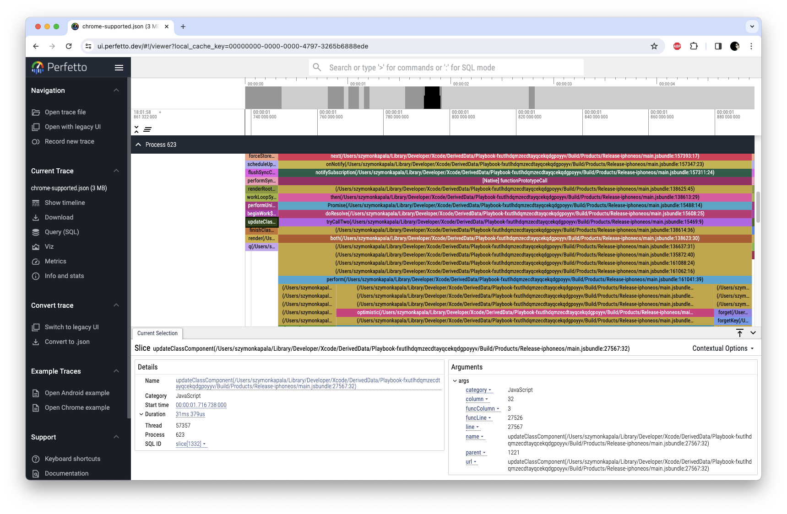

<a href="https://margelo.io">
  
</a>

# react-native-release-profiler

A fast and simple library to passively profile JS/Hermes performance in production and release builds.

## Why

Usually performance issues are profiled in debug builds, which could lead to false positives (e.g. JS Garbage Collectors, Hermes-specific debug markers, or other LLDB hangs).

**react-native-release-profiler** allows you to profile your app in release builds, both in a local environment to profile specific issues, as well as in a production environment to spot regressions or collect performance samples from a wider variety of user devices.

## Web support

The web support is based on sampling [JS Self-Profiling](https://wicg.github.io/js-self-profiling/) API, so not all browsers support it yet. To see in which browsers it is supported, check [this page](https://caniuse.com/mdn-api_profiler).

> [!WARNING]
> By default sampling interval is set to 10 milliseconds. This is the lowest supported interval, but on Windows machines this interval will be 16 milliseconds.

## Need help?

If you're having performance problems in your app, feel free to reach out to us at hello@margelo.io. We do this a lot. 😉

## Installation

```sh
yarn add react-native-release-profiler
cd ios && pod install
```

## Usage

1. Install **react-native-release-profiler**
2. Build your app in release mode
3. Start a profiling session:
    ```ts
    import { startProfiling } from 'react-native-release-profiler'

    startProfiling()
    ```
4. Stop the profiling session:
    ```ts
    import { stopProfiling } from 'react-native-release-profiler'

    // `true` to save the trace to the phone's downloads folder, `false` otherwise
    const path = await stopProfiling(true)
    ```
5. Download and process the performance trace from your phone to your PC:
    - On **Android**:
        ```bash
        npx react-native-release-profiler --fromDownload --appId <your appId>
        ```
    - On **iOS**:
        ```bash
        npx react-native-release-profiler --local <path to profile>
        ```
    - On **web**:
        ```bash
        npx react-native-release-profiler --file <path to profile>
        ```
6. Open the performance trace in your tool of choice:
    - SpeedScope (https://www.speedscope.app)
    - Perfetto UI (https://ui.perfetto.dev/)
    - Google Chrome's Tracing UI ([chrome://tracing](chrome://tracing))




## API

### `startProfiling(): void`

Synchronously starts the Hermes Profiling Session.

### `stopProfiling(saveInDownloadsDirectory: boolean): Promise<string>`

Asynchronously stops the Hermes Profiling Session, and saves the file in a cache or downloads directory if `saveInDownloadsDirectory` is `true`.

Returns the path of the saved profile.

## Contributing

See the [contributing guide](CONTRIBUTING.md) to learn how to contribute to the repository and the development workflow.

## License

MIT
